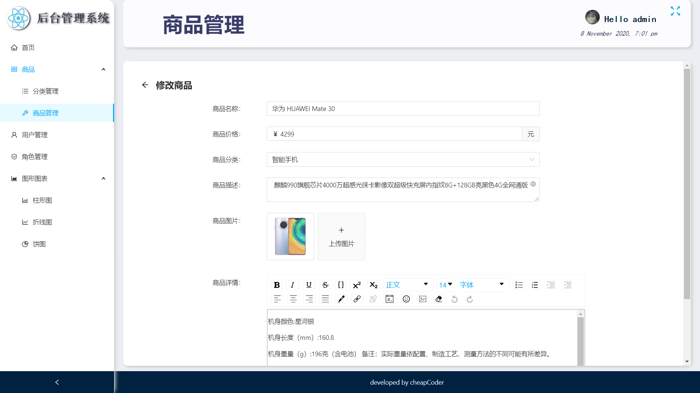
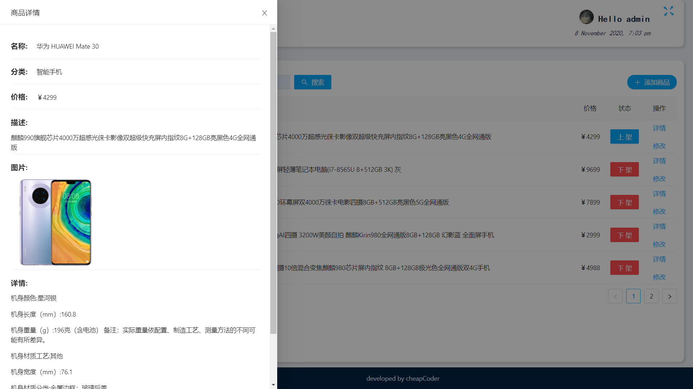
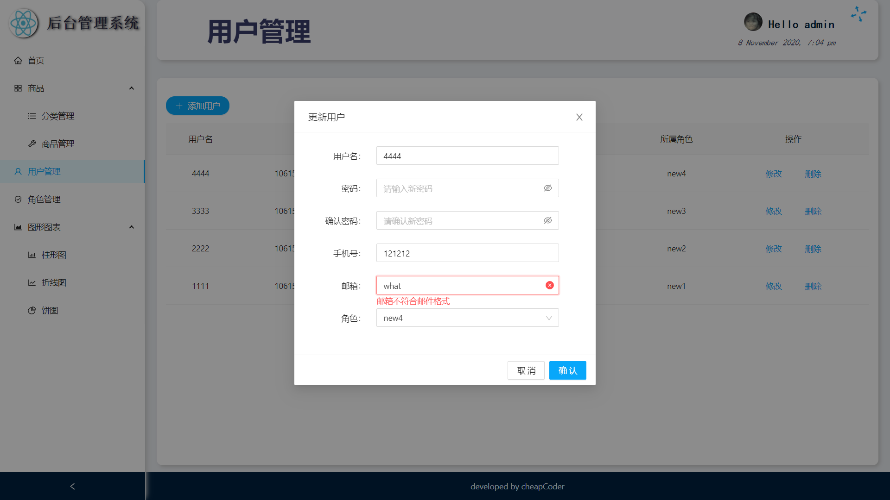
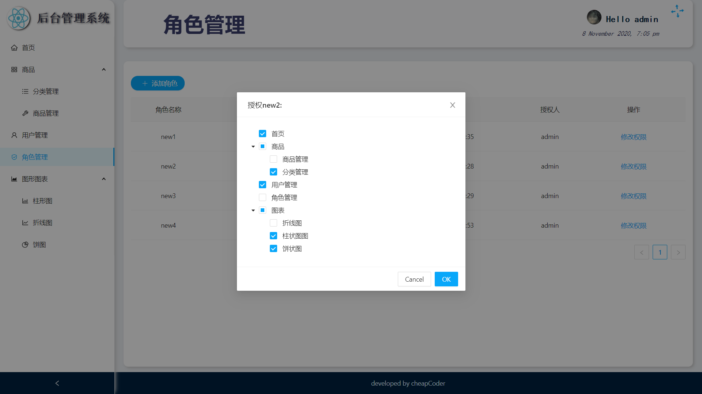
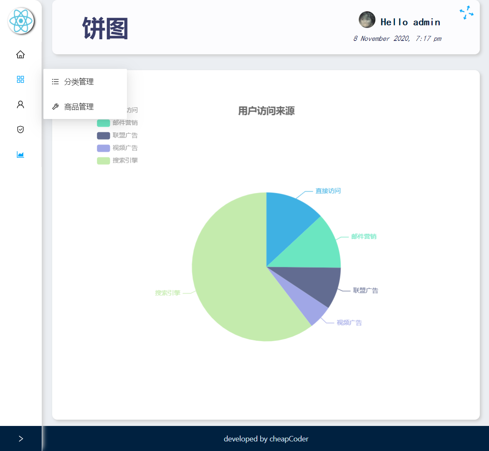
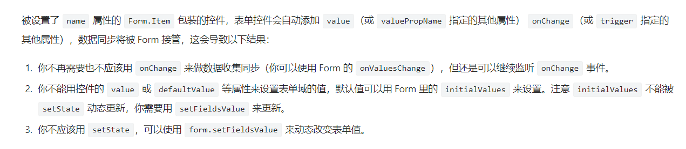

# 介绍

# React 项目任务列表

-   [x] 使用 create-react-app 创建基于 react 脚手架应用,

-   [x] antd 按需引入，自定义主题色(主题色：#08a7fa)

-   [x] 搭建项目 redux 开发环境(redux, react-redux, redux-thunk, redux devtools extension)

-   [x] login 静态页面

-   [x] login 的 Form 表单的静态 Form

-   [x] login 的 Form 表单给用户名，密码加校验，声明式验证

    > 用户名/密码的的合法性要求
    >
    > 1). 必须输入
    > 2). 必须大于 4 位
    > 3). 必须小于 12 位
    > 4). 必须是英文、数字或下划线组成

-   [x] 封装原生 axios，使用请求拦截器统一更改 post 请求参数为 urlencoded 编码

-   [x] 在 config 文件夹配置，保存通用性的配置和变量

-   [x] 引入 nprogress

-   [x] 使用响应拦截器，统一处理所有 ajax 请求的错误 + 从 axios 返回对象中提取真正服务器返回的数据

-   [x] 引入 react-router

-   [x] Redux 保存 user 和 token 数据，完成自动登录

-   [x] **使用 es6 的装饰器语法更改 connect 方法**，安装@babel/plugin-proposal-decorators, 并在 config-overrides.js 中配置 addDecoratorsLegacy

-   [x] Admin 界面布局 -- 使用 antd 的 Layout 组件

-   [x] Header 组件静态

-   [x] 完成退出登录逻辑

-   [x] 解决 token 到期或修改后未自动跳转到登陆页的 bug，用拦截器解决

-   [x] Header 组件交互--全屏切换，使用 screenfull 库

-   [x] Header 组件交互--退出登录，使用 antd 的 Modal 提示框组件

-   [x] 利用 antd 完成左侧导航静态布局及切换效果

-   [x] 使用全家桶内的 menu.js 遍历递归生成左侧导航菜单

-   [x] Admin 子路由搭建

-   [x] 左侧菜单栏的 current 显示和自动打开

-   [x] 完成模拟网速(慢 3G 情况下)请求数据时的 loading 效果

-   [x] 右上角添加按钮新增和修改商品分类

-   [x] 商品管理的静态页面

-   [x] 商品管理页面的上架和下架按钮

-   [x] 商品搜索功能

-   [x] 修复 bug: 点击搜索后再点击分页导航按钮时商品又变成所有商品，完善搜索按钮，分页按钮点击时的商品请求函数

-   [x] 完成商品菜单，商品里的分类管理用前端分页，商品管理用后端分页

-   [x] 使用 antd 组件 Drawer 搭建商品详情 Detail 组件

-   [x] 详情页的静态页面，从父组件获取商品的详细信息并展示

-   [x] 商品修改 changeProduct 路由(用多个相似路由或用 exact)

-   [x] 封装图片上传组件

-   [ ] 图片上传组件与后台交互，**图片限制宽高**

-   [x] 用 Wysiwyg 完成富文本编辑器，或者用其他的库

-   [x] 角色路由组件的卡片，表格展示，增加角色按钮逻辑，权限设置逻辑和树形控件的引入，回显，添加 menu 菜单全选按钮

-   [x] 不同角色的不同 menu 菜单显示，登陆权限验证

-   [x] 利用 echart 实现 charts 页的 pie、line、bar 表

-   [ ] 优化组件数据配置，将可变数据放到最前

-   [ ] **配置 eslint-plugin-react-hooks 插件，尝试使用 hook 重构 class 组件，首先就是 category.jsx，class 和 hook 都用了**

-   [ ] 将组件的配置项提升到文件前方或到单个一个文件内,

-   [ ] 优化代码结构，统一风格

    -   [ ] 自定义的函数用 handle 开头，antd 的回调用 on 开头
    -   [ ] 统一 modal 组件显示用`<modal/>`或是 modal 的 api

-   [ ] 完善组件间的 propsType

-   [ ] 将请求发送转到 action 中

-   [ ] **通过 mock 模拟所有后台数据**
-   不同角色，路由不同（动态路由）

# 所遇问题及解决方式

-   [x] CSS: filter: blur 的白边问题

    > ​ admin 使用对 footer 使用定位后就没了？？？

-   [x] 登陆页的背景在 F12 打开控制台并显示在下方后，图片高度减少并出现滚动条

    > ​ admin 使用对 footer 使用定位后就没了？？？

-   [ ] 自己封装的 axios 请求拦截器每次都会带 token 发送 check_token 请求，应该额外判断这种情况并中断 axios 请求

-   [x] 无 token 信息自动跳转到 login 页面时会**显示两次 401 消息**

    > ​ 单独判断，将其交给 admin 组件单独显示

-   [x] login 登陆成功跳转到 admin 页面，redux 中是新数据，但控制台仍打印老数据

    > ​ login 登陆逻辑错误，应先发出 action 数据更新 redux，在进行路由跳转
    >
    > ​ **注意善用 debugger 语句**

-   [x] 左侧 sider 组件折叠时，项目标题“后台管理系统”使用 visibility 或 display:none 多会有挤压下方菜单 menu 再回弹的情况

    > ​ 不能用 visibility，隐藏后仍占位，会挤压下方菜单 menu
    >
    > 给 sider 绑定 onTransitionEnd 事件并借助 state 的 collapsed 属性判断 dispalay 为 none 还是 inline
    >
    > 在修改 collapse 的回调中再次判断 display 值并修改，注意 setState 的异步性

-   [x] antd 4x 的图标名称无法动态指定

    > ​ issue 链接：https://github.com/ant-design/ant-design/issues/20668
    >
    > 使用兼容 v3 的库[Ant Design Compatible](https://github.com/ant-design/compatible#icon), 但会全量引入 icon, 增大包体积，且控制台报错
    >
    > 
    >
    > **期待更优雅的方案！**

-   [x] 首次加载路由为 admin 导致无默认选中菜单的 bug

    > ​ 进行判断，为 admin 则将 defaultSelectedKeys 该为 home

-   [x] admin 的 footer 部分全屏时下方有 2px 的白边

    > ​ 给 footer 组件添加绝对定位，**为什么相对定位不行？**

-   [x] 在组件外定义无联系的函数方法是否有害于组件本身，如 mySider 内的 flatten 函数

    > ​ 已经移动当`utils`文件夹作为工具函数

-   [x] 每次修改 category 列表数据显示都会翻转(reverse)

    > ​ 使用 arr.reverse 会修改原数组，用三点运算符复制一份在 reverse

-   [x] **跳转至 changeProduct 路由后 header 的 name 标题仍然是“商品管理”**，且刷新后会消失

    > ​ 单独判断，changProduct 仍属于 product 路由，key 为"changeProduct"则修改为"product"

-   [x] antd 库 Form 的 initialValue 设置无效

    > ​ antd4 的 initialValue 设置到 Form 组件的话可[传递对象指定 Form.Item 的 initialValue](https://ant.design/components/form/v3-cn#%E5%88%9D%E5%A7%8B%E5%8C%96%E8%B0%83%E6%95%B4)
    >
    > ​ **写到 Form.Item 组件里的话注意需要有 name 属性才会生效**

-   [ ] **如果是网络请求失败，在 instance 里中断了 promise 会导致请求 await 后的代码永远不执行**

-   [x] 图片上传组件 ImgWall 的图片上传后台返回失败，后台使用 multer 库

    > **结论：**antd4 的 Upload 组件应该有 name 属性，且与 upload.single(field)的 field 一致
    >
    > 过程：前端无报错，查看后端源码，打印`upload.single(field)`的回调函数的`err`报出`MulterError: Unexpected field`的错误，谷歌后发现需要字段对应，则添加 name 属性，成功！(antd 文档：`name: 发到后台的文件参数名`)
    >
    > 参考：https://stackoverflow.com/questions/31530200/node-multer-unexpected-field
    >
    > ​ https://blog.csdn.net/kobe246/article/details/79380948
    >
    > 其他：antd 4x. upload 组件上传博客学习：https://anandzhang.com/posts/frontend/14

-   [ ] **big bug: 自定义图片上传时机为点击‘提交’时，不然若直接退出或地址跳转走了商品的图片信息为上传到数据库但图片却上传了导致耗费内存([参考链接](https://ant.design/components/upload-cn/#components-upload-demo-upload-manually))**

-   [x] **product 页在分页器在非 1 时，点击搜索应跳转到第一页**

    > ​ 添加 state 属性 currentPage，通过 antd 的 pagination 的 current 属性绑定 currentPage

-   [ ] category, role, user 页的`添加`按钮应该一显示就自动聚焦, 且加入重复自动清除 Input 的值

-   [x] \*\*多次点击不同用户号的`修改`按钮显示的用户信息有延迟，使用`setState`的回调函数也不行

    > ​ form 的值修改不能用 setState，要用 setFieldValue，
    >
    > 

-   [x] **通过动态渲染左侧导航栏来实现权限验证不可取，可能会通过地址栏地址跳转**

    > react 路由鉴权学习：https://juejin.im/post/6844903924441284615#heading-2
    >
    > 通过 Admin 组件判断当前路由地址是否有权限访问

-   [ ] 无 User 路由组件访问权限的用户地址访问时 react 报内存泄漏的错误

    > 原因：进入 user 路由，挂载后用户列表请求还未完成
    >
    > 解决：（**此方法不行，统一添加无效**！~~在请求拦截器里统一添加 axios 的 cancelToken，并暴露出 cancel 函数，在 user，role 组件卸载时执行，~~~~也可写成高阶组件(HOC)形式）~~

-   [x] 无权限页自动跳转到 home 页时`home`的菜单不选中

    > ​ MySider 组件页面跳转不会重新挂载，将 menus 的 defaultSelectedKeys 参数改成 selectedKeys

# 踩坑记录

1. react 里 setState 对象或数组要解构，因为最后都是引用同一个对象
2. 组件引入图片等需要使用 import 引入，在 img 标签中使用变量指定目标图片
3. 利用 state 作为任意两标签间通信的介质
4. **this.setState 是异步的** 
5. redux 的 action 和 state 都是传入组件的，通过 this.props 读取
6. 使用 nprogress 要引入样式
7. fullscreen 库更改全屏的 api toggle 是异步的，返回 promise，需要在 then 中 setState 新的全屏属性 isFullScreen
8. antd 会"干扰"css 的 color 属性继承，不要给给父元素加 color 而是直接加在当前元素上
9. antd 4.获取 form 字段通过在 form 元素上添加 ref 获取，[参考博客地址](https://anandzhang.com/posts/frontend/10)
10. react-router 传参的方式：
    > 1. query
    > 2. params
    > 3. state
11. antd 的 Form 组件[隐藏必填表单会出现的星号](https://github.com/ant-design/ant-design-pro/issues/2044)：`hideRequiredMark： 隐藏所有表单项的必选标记 | Boolean | false`
12. 后端只有对添加商品时的重名检查，而更新商品时则没有重名检查
13. `arr.prototype.splice()`返回被删除元素的数组而不是修改后的数组
14. axios 的 cancelToken 是单独一项配置，不在 header 里
