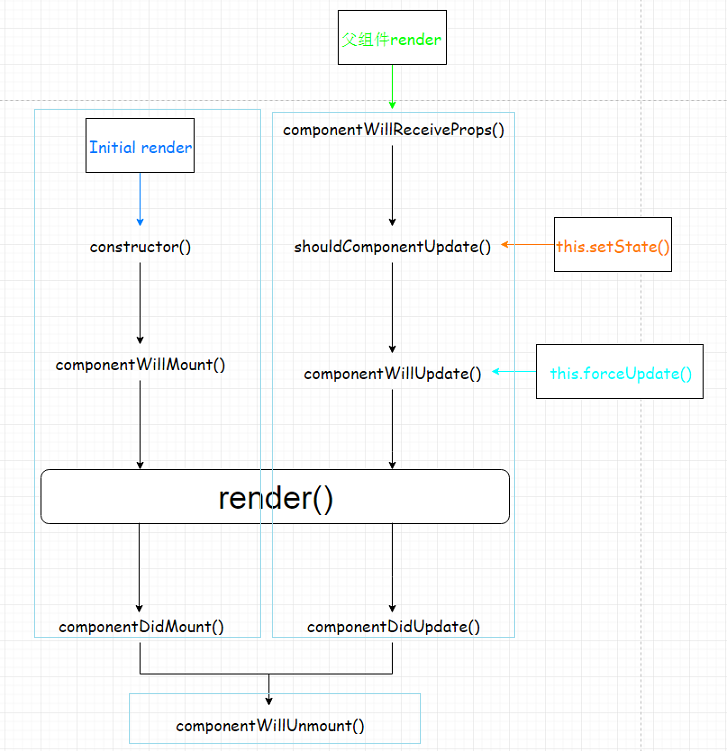

# 第1章. React入门
## 1.1. React的基本认识
1. Facebook开源的用来动态构建用户界面的js库

2. React的特点
   - Declarative(声明式编码)
   - Component-Based(组件化编码)
   - Learn Once, Write Anywhere(支持客户端与服务器渲染)
   - 高效
   - 单向数据流
   
3. React高效的原因			
   
   - ​	虚拟(virtual)DOM, 不总是直接操作DOM(批量更新, 减少更新的次数) 
   - ​	高效的DOM Diff算法, 最小化页面重绘(减小页面更新的区域)
   

## 1.2 React的基本使用

```jsx
1). 导入相关js库文件(react.js, react-dom.js, babel.min.js)   //注意按此顺序
2). 编码:
	<div id="container"></div>
	<script type="text/babel">   //使用babel翻译jsx
			const vDOM = <h1>hello react</h1>;
    	//渲染方式一
		ReactDOM.render(vDOM, containerDOM)  //虚拟dom不用加引号    containerDOM:渲染位置   
    	//渲染方式二
    	const vDOM1 = React.createElement("h1", {id: "what" }, tagContent);
	</script>
```


## 1.3 虚拟DOM

>本质是一个对象，比真实dom轻，因为属性少，最终会被转化为真实dom

1. 纯JS(一般不用)

   `React.createElement('h1',  {id:'myTitle'}, title)`

2. JSX:

   `<h1 id='myTitle'>{title}</h1>  //多级标签最外层应包一个括号`

## 1.4. JSX的理解和使用

1. 理解

   全称: JavaScript XML

   react定义的一种类似于XML的JS扩展语法: XML+JS

   本质是React.createElement(component, props, ...children) 方法的语法糖

   作用: 用来创建react虚拟DOM(元素)对象

   注意：

   - jsx不是字符串，也不是HTML标签

   - 最终产生js对象

2. 编码相关
	- 遇到 <开头的代码, 以标签的语法解析: html同名标签转换为html同名元素, 其它标签需要特别解析
	- 遇到以 { 开头的代码，以JS语法解析: 标签中的js表达式必须用{ }包含
	- 标签必须有结束
	- 标签的class属性必须改为className属性

## 1.5 模块与组件

|             |                           模块                           |                             组件                             |
| :---------: | :------------------------------------------------------: | :----------------------------------------------------------: |
|    理解     |       向外提供特定功能的js程序, 一般就是一个js文件       |     用来实现特定界面功能效果的代码集合(html/css/js/img)      |
|   为什么    |                     js代码更多更复杂                     |                    一个界面的功能太复杂了                    |
|    作用     |           复用js, 简化js的编写, 提高js运行效率           |           复用编码, 简化项目界面编码, 提高运行效率           |
| 模块/组件化 | 当应用的js都以模块来编写的, 这个应用就是一个模块化的应用 | 当应用是以多组件的方式实现功能, 这上应用就是一个组件化的应用 |


# 第2章. react组件化开发

## 2.1 基本理解和使用

### 2.1.1 自定义组件(Component) :

1)    定义组件(2种方式)

1. 工厂函数组件(无状态/简单组件)

   ```jsx
   function MyComponent () {  
       return <h2>工厂函数组件(简单组件)</h2> 
   }
   ```

   渲染过程：

   - 寻找MyComponent的定义
   - 调用同名的工厂函数并渲染其返回值

2. ES6类组件(有状态/复杂组件)

   ```jsx
   class MyComponent2 extends React.Component {  
       render () { 	// 重写方法   
           console.log(this) // MyComponent2的实例对象    
           return <h2>ES6类组件(复杂组件)</h2>  
       }
   }
   ```

   渲染过程：

   - 创建类的实例
   - 通过类的实例调用render函数
   - 渲染函数返回值

2)    渲染组件标签

```
ReactDOM.render(<MyComponent />, document.getElementById('example1'))
```

### 2.1.2 注意

1)    **组件名必须首字母大写**

2)    虚拟DOM元素只能有**一个根元素**

3)    虚拟DOM元素必须**有结束标签**

### 2.1.3 render()渲染类组件标签的基本流程

1)    React内部会创建组件实例对象

2)    调用render()得到虚拟DOM, 并解析为真实DOM

3)    插入到指定的页面元素内部

## 2.2. 组件三大属性1: state

### 2.2.1 理解

1)    state是组件实例对象最重要的属性, 值是对象(可以包含多个key-value的组合)

2)    组件被称为"状态机", 通过更新组件的state来更新对应的页面显示(重新渲染组件)

### 2.2.2. 编码操作

1)    初始化状态:

```javascript
constructor (props) {
 super(props)
 this.state = {
 stateProp1 : value1,
 }
}
```

2)    读取某个状态值

```
this.state.statePropertyName
```

3)    更新状态---->组件界面更新 (必须使用this.**setState**)

```javascript
 this.setState({  			
  stateProp1 : value1
 }) 
```

### 2.2.3. 强烈注意

1. 组件**内置的方法**(render)中的this为**组件对象**

2. 在组件类中**自定义的方法**中this为**undefined**

   解决方式：

   1. 强制绑定this: 通过函数对象的bind()
   2. 箭头函数(ES6模块化编码时才能使用, 推荐)  

3. 状态数据，不能直接修改或更新，使用this.setState(option), 且覆盖同名的不替换

4. tag内绑定事件用驼峰命名法(onClick)，而原生则为小写(onclick)

## 2.3. 组件三大属性2: props

> 组件标签的所有属性都保存在props中
>
> 通过标签属性从组件外向组件内传递变化的数据
>
> 注意: **组件内部不要修改props数据**

1)    内部读取某个属性值

```javascript
 this.props.name        
```

2)    对props中的属性值进行类型限制和必要性限制

- 第一种方式(**React v15.5 开始已弃用**)：


```javascript
Person.propTypes = {
	name: React.PropTypes.string.isRequired,
    age: React.PropTypes.number
}
```

- 第二种方式（新）：


```javascript
//使用prop-types库进限制（需要引入prop-types库, 可放入类中，加上static）
Person.propTypes = {  // 此行的propTypes的p为小写
	name: PropTypes.string.isRequired,
	age: PropTypes.number    // 此行的PropTypes的p为大写
}
```

3)  扩展属性: 将对象的所有属性通过props传递

```javascript
<Person {...person\}/>    
```

> es对象没有遍历器，展开报错，react+babel已支持但仅限于组件标签传参

4)    默认属性值

```javascript
Person.defaultProps = {
    age: 18,
    sex:'男'
} 
```

5)    组件类的构造函数

```javascript
constructor(props){
	super(props);
    console.log(props)//打印所有属性
}
```

## 2.4. 组件三大属性3: refs与事件处理

### 2.4.1. 组件的3大属性之二: refs属性

> ref属性应尽量少用

1)    老版本语法

组件内的标签都可以定义ref属性来标识自己

```react
// input为当前节点，userInput为此节点的refs属性名, 对实例增加属性userInput
<input type="text" ref={input => this.userInput = input}/>
```

2)    新版本语法

使用 **React.createRef()** 创建用于保存dom元素的ref对象

```react
constructor(props) {
 super(props)
 this.myRef = React.createRef()  // 返回一个对象只保存一个节点的信息，写多个会覆盖
}
```

通过 ref 标签属性将DOM元素对象保存到**ref对象的current属性**上

```react
<input type="text" ref={this.myRef}/>
```

获取指定了ref的dom元素对象

```react
const input = this.myRef.current
```

### 2.4.2. 事件处理

1)    通过onXxx属性指定组件的事件处理函数(**注意大小写**)

a.    React使用的是自定义(合成)事件, 而不是使用的原生DOM事件

b.    React中的事件是通过事件委托方式处理的(委托给组件最外层的元素)

2)    通过event.target得到发生事件的DOM元素对象

## 2.5. 功能界面的组件化编码流程(通用/无比重要)

1. 拆分组件: 拆分界面,抽取组件
2. 实现静态组件: 使用组件实现静态页面效果
3. 实现动态组件

4. 动态显示初始化数据

5. 数据类型

6. 数据名称

7. 保存在哪个组件?

8. 交互(从绑定事件监听开始)

## 2.6. 组件生命周期

> - 组件对象从创建到死亡它会经历特定的生命周期阶段
> - React组件对象包含一系列的勾子函数(生命周期回调函数), 在生命周期特定时刻回调
> - 我们在定义组件时, 可以重写特定的生命周期回调函数, 做特定的工作

### 2.6.3. 生命周期流程图(旧)



  1.【初始化】

​    触发条件：ReactDOM.render(<MyComponent/>)

- ​     constructor()
- ​     componentWillMount()
- ​     render():提供虚拟DOM，可能会调用多次(1+n)。
- ​     componentDidMount()：启动定时器、发送Ajax请求、只执行一次。 

  2.【更新】

​    触发条件：**this.setState({})**

- ​     componentWillUpdate()
- ​     render()
- ​     componentDidUpdate() 

  3.【卸载】

​    触发条件：ReactDOM.unmountComponentAtNode()

- ​    componentWillUnmount()：收尾工作，例如：清除定时器，只执行一次。


### 2.6.4 生命周期详述

1)    组件的三个生命周期状态:

  \ 初始化阶段：第一次渲染，插入真实DOM

  \ 更新阶段：重新渲染

  \ 卸载阶段：被移出真实 DOM  

2)    生命周期流程:

a.    初始化阶段: 由ReactDOM.render()触发

   \ constructor()

   \ static getDerivedStateFromProps() 

   \ render()

   \ componentDidMount()

b.    更新阶段 由组件内部this.setSate()或父组件重新render触发

   \ static getDerivedStateFromProps()

\ shouldComponentUpdate()

   \ render()

 \ getSnapshotBeforeUpdate()

   \ componentDidUpdate()

c.    移除组件: 由ReactDOM.unmountComponentAtNode(containerDom)触发

   \ componentWillUnmount()

### 2.6.5 即将废弃的勾子

1)    componentWillMount()

2)    componentWillReceiveProps()

3)    componentWillUpdate()

现在使用会出现警告，下一个大版本需要机上UNSAFE_前缀才能使用，下下个版本会被彻底废弃，不建议使用。

### 2.6.6. 生命周期流程图(新)

### 2.6.7. 新增的钩子

1)    getDerivedStateFromProps：相当于之前的componentWillMount和componentWillUpdate

2)    getSnapshotBeforeUpdate：介于componentDidUpdate和render之间

### 2.6.8. 重要的勾子

3)    render(): 初始化渲染或更新渲染调用

4)    componentDidMount(): 开启监听, 发送ajax请求

5)    componentWillUnmount(): 做一些收尾工作, 如: 清理定时器

6)    static getDerivedStateFromProps(): state是根据props来生成的那就需要借助这个函数

 


## 2.8. 虚拟DOM与DOM Diff算法

### 2.8.1. 效果

 

 

```
class HelloWorld extends React.Component {  constructor(props) {   super(props)   this.state = {     date: new Date()   }  }    componentDidMount () {   setInterval(() => {    this.setState({      date: new Date()    })   }, 1000)  }    render () {   console.log('render()')   return (    <p>     Hello, <input type="text" placeholder="Your name here"/>!       It is {this.state.date.toTimeString()}    </p>   )  } }  ReactDOM.render(  <HelloWorld/>,  document.getElementById('example') )
```

 

### 2.8.2. 基本原理图

 

# 第3章：react应用(基于react脚手架)

## 3.1. 使用create-react-app创建react应用

### 3.1.1. react脚手架

1)    xxx脚手架: 用来帮助程序员快速创建一个基于xxx库的模板项目

a.    包含了所有需要的配置

b.    指定好了所有的依赖

c.    可以直接安装/编译/运行一个简单效果

2)    react提供了一个用于创建react项目的脚手架库: create-react-app

3)    项目的整体技术架构为: react + webpack + es6 + eslint

4)    使用脚手架开发的项目的特点: 模块化, 组件化, 工程化

### 3.1.2. 创建项目并启动

npm install -g create-react-app  (只需一次)

create-react-app peiqi    (在指定的目录下去执行，创建react脚手架应用)

cd hello-react

npm start

 

### 3.1.3. react脚手架项目结构

ReactNews

 |--node_modules---第三方依赖模块文件夹

 |--public

   |-- index.html-----------------主页面

 |--src------------源码文件夹

   |--components-----------------react组件

   |--index.js-------------------应用入口js

 |--.gitignore------git版本管制忽略的配置

 |--package.json----应用包配置文件 

 |--README.md-------应用描述说明的readme文件

 

## 3.2. demo: 评论管理

### 3.2.1. 效果

 

### 3.2.2. 拆分组件

应用组件: App

\ state: comments/array

添加评论组件: CommentAdd

\ state: username/string, content/string

\ props: add/func

评论列表组件: CommentList

\ props: comment/object, delete/func, index/number

评论项组件: CommentItem

\ props: comments/array, delete/func

### 3.2.3. 实现静态组件

### 3.2.4. 实现动态组件

动态展示初始化数据

\ 初始化状态数据

​     \ 传递属性数据

响应用户操作, 更新组件界面

​     \ 绑定事件监听, 并处理

​     \ 更新state

# 第4章：react ajax

## 4.1. 理解

### 4.1.1. 前置说明

1)    React本身只关注于界面, 并不包含发送ajax请求的代码

2)    前端应用需要通过ajax请求与后台进行交互(json数据)

3)    react应用中需要集成第三方ajax库(或自己封装)

### 4.1.2. 常用的ajax请求库

1)    jQuery: 比较重, 如果需要另外引入不建议使用

2)    axios: 轻量级, 建议使用

a.    封装XmlHttpRequest对象的ajax

b.    promise风格

c.    可以用在浏览器端和node服务器端

3)    fetch: 原生函数, 但老版本浏览器不支持

a.    不再使用XmlHttpRequest对象提交ajax请求

b.    为了兼容低版本的浏览器, 可以引入兼容库fetch.js

### 4.1.3. 效果

```
需求:
  1. 界面效果如下
  2. 根据指定的关键字在github上搜索匹配的最受关注的库
  3. 显示库名, 点击链接查看库
4. 测试接口: https://api.github.com/search/repositories?q=r&sort=stars

```

## 4.2. axios

### 4.2.1. 文档

https://github.com/axios/axios

### 4.2.2. 相关API

1)    GET请求

  axios.get('/user?ID=12345')   .then(function (response) {    console.log(response.data);   })   .catch(function (error) {    console.log(error);   });     axios.get('/user',  {    params: {     ID: 12345    }   })   .then(function (response) {    console.log(response);   })   .catch(function (error) {    console.log(error);   });     

 

2)    POST请求

  axios.post('/user', {      firstName: 'Fred',      lastName: 'Flintstone'  })  .then(function (response) {     console.log(response);  })  .catch(function (error) {     console.log(error);  });  

 

 

## 4.3. Fetch

### 4.3.1. 文档

1)    https://github.github.io/fetch/

2)    https://segmentfault.com/a/1190000003810652

### 4.3.2. 相关API

1)    GET请求

  fetch(url).then(function(response)  {   return response.json()  }).then(function(data)  {   console.log(data)  }).catch(function(e)  {   console.log(e)  });  

 

2)    POST请求

  fetch(url, {     method: "POST",     body: JSON.stringify(data),  }).then(function(data) {   console.log(data)  }).catch(function(e)  {   console.log(e)  })  

 

## 4.5. demo: github用户搜索

### 4.5.1. 效果

 

### 4.5.2. 拆分组件

App

​         \ state: searchName/string

  Search

​     \ props: setSearchName/func

  List

​     \ props: searchName/string

​     \ state: firstView/bool, loading/bool, users/array, errMsg/string

### 4.5.3. 编写静态组件

### 4.5.4. 编写动态组件

componentWillReceiveProps(nextProps): 监视接收到新的props, 发送ajax

​     使用axios库发送ajax请求

# 第5章：几个重要技术总结

## 5.1. 组件间通信

### 5.1.1. 方式一: 通过props传递

1)    共同的数据放在父组件上, 特有的数据放在自己组件内部(state)

2)    通过props可以传递一般属性和函数属性, 只能一层一层传递

3)    一般属性-->父组件传递数据给子组件-->子组件读取数据

4)    函数属性-->子组件传递数据给父组件-->子组件调用函数

5)    适用：最好应用在父传子

### 5.1.2. 方式二: 使用消息订阅(subscribe)-发布(publish)机制

1)    工具库: PubSubJS

2)    下载: npm install pubsub-js --save

3)    使用: 

​      import PubSub from 'pubsub-js' //引入

​      PubSub.subscribe('delete', function(data){ }); //订阅

​      PubSub.publish('delete', data) //发布消息

 

### 5.1.3. 方式三: redux

后面专门讲解

### 5.1.4. 面试题: 比较react中组件间3种通信方式

```
1). 方式一: 通过props传递   通过props可以传递一般数据和函数数据,    一般数据-->父组件向子组件   函数数据-->子组件向父组件通信   缺点: 只能一层一层传递/兄弟组件必须借助父组件   2). 方式二: 使用消息订阅(subscribe)-发布(publish)机制   实现库: pubsub-js   组件A: 发布消息(相当于触发事件)   组件B: 订阅消息, 接收消息, 处理消息(相当于绑定事件监听)   优点: 对组件关系没有限制   3). 方式三: redux   通过redux可以实现任意组件间的通信   集中式管理多个组件共享的状态, 而pubsub-js并不是集中式的管理
```

 

## 5.2. 事件监听理解

### 5.2.1. 原生DOM事件

1)    绑定事件监听 

a.    目标元素

b.    事件名(类型): 只有有限的几个, 不能随便写

c.    回调函数: 接收数据并处理

2)        触发事件

a.    用户操作界面

b.    事件名(类型)

c.    数据(event)

### 5.2.2. 自定义事件(消息机制)

1)    绑定事件监听(订阅消息)

a.    目标元素

b.    事件名(类型): 任意

c.    回调函数: 通过形参接收数据, 在函数体处理事件

2)    触发事件(编码, 发布消息)

a.    (事件名类型): 与绑定的事件监听的事件名一致

b.    数据: 会自动传递给回调函数

## 5.3. ES6常用新语法

1)    定义常量/变量: const/let

2)    解构赋值: let {a, b} = this.props function fn({name}) {} fn({name: ‘tom’})

3)    对象的简洁表达: {a, b}

4)    箭头函数: 

a.    常用场景

\ 组件的自定义方法: xxx = () => {}

\ 参数匿名函数

b.    优点:

​         \ 简洁

​         \ 没有自己的this,使用引用this查找的是外部this

5)    扩展(三点)运算符: 拆解对象(const MyProps = {}, <Xxx {...MyProps}>)

6)    类: class/extends/constructor/super

7)    ES6模块化: export default | import

8)    promise

9)    async/await

# 第6章：react-router5

## 6.1. 相关理解

### 6.1.1. react-router-dom的理解

1)    react的一个插件库

2)        专门用来实现一个SPA应用

3)        基于react的项目基本都会用到此库

### 6.1.2. SPA的理解

1)    单页Web应用（single page web application，SPA）

2)        整个应用只有一个完整的页面

3)        点击页面中的链接不会刷新页面, 本身也不会向服务器发请求

4)        当点击路由链接时, 只会做页面的局部更新

5)        数据都需要通过ajax请求获取, 并在前端异步展现

### 6.1.3. 路由的理解

1)    什么是路由?

a.    一个路由就是一个映射关系(key:value)

b.    key为路由路径, value可能是function/component

2)    路由分类

a.    后台路由: node服务器端路由, value是function, 用来处理客户端提交的请求并返回一个响应数据

b.    前台路由: 浏览器端路由, value是component, 当请求的是路由path时, 浏览器端前没有发送http请求, 但界面会更新显示对应的组件 

3)    后台路由

a.    注册路由: router.get(path, function(req, res))

b.    当node接收到一个请求时, 根据请求路径找到匹配的路由, 调用路由中的函数来处理请求, 返回响应数据

4)        前端路由

a.    注册路由: <Route path="/about" component={About}>

b.    当浏览器的hash变为/about时, 当前路由组件就会变为About组件

### 6.1.4. 前端路由的实现

1)    history库

a.    网址: https://github.com/ReactTraining/history

b.    管理浏览器会话历史(history)的工具库

c.    包装的是原生BOM中window.history和window.location.hash

2)    history API

a.    History.createBrowserHistory(): 得到封装window.history的管理对象

b.    History.createHashHistory(): 得到封装window.location.hash的管理对象

c.    history.push(): 添加一个新的历史记录

d.    history.replace(): 用一个新的历史记录替换当前的记录

e.    history.goBack(): 回退到上一个历史记录

f.     history.goForword(): 前进到下一个历史记录

g.    history.listen(function(location){}): 监视历史记录的变化

3)    测试

​    

```
<!DOCTYPE html>  <html lang="en">  <head>  <meta charset="UTF-8">  <title>history test</title>  </head>  <body>  <p><input type="text"></p>  <a href="/test1" onclick="return push('/test1')">test1</a><br><br>  <button onClick="push('/test2')">push test2</button><br><br>  <button onClick="back()">回退</button><br><br>  <button onClick="forword()">前进</button><br><br>  <button onClick="replace('/test3')">replace test3</button><br><br>    <script type="text/javascript" src="https://cdn.bootcss.com/history/4.7.2/history.js"></script>  <script type="text/javascript">   let history\ = History.createBrowserHistory() // 方式一    // history = History.createHashHistory() // 方式二    // console.log(history)       function push (to) {    history\.push(to)    return false    }     function back() {    history\.goBack()   }     function forword() {    history\.goForward()   }     function replace (to) {    history\.replace(to)   }     history\.listen((location) => {    console.log('请求路由路径变化了', location)   })  </script>  </body>  </html>
```

 

## 6.2. react-router相关API

### 6.2.1. 组件

1)    <BrowserRouter>

2)    <HashRouter>

3)    <Route>

4)    <Redirect>

5)    <Link>

6)    <NavLink>

7)    <Switch>

### 6.2.2. 其它

1)    history对象

2)    match对象

3)    withRouter函数

## 6.3. 基本路由使用

### 6.3.1. 效果

 

### 6.3.2. 准备

1)    下载react-router-dom: npm install --save react-router-dom@4

2)    引入bootstrap.css: <link rel="stylesheet" href="/css/bootstrap.css">

### 6.3.3. 路由组件: views/about.jsx

```
import React from 'react'   export default function About() {  return <div>About组件内容</div> }
```

 

### 6.3.4. 路由组件: views/home.jsx

  import React from 'react'   export default  function Home() {    return <div>Home组件内容</div>   }  

 

### 6.3.5. 包装NavLink组件: components/my-nav-link.jsx

```
import React from 'react'   import {NavLink} from 'react-router-dom'      export default function MyNavLink(props) {  return <NavLink {...props} activeClassName='activeClass'/> }
```

 

### 6.3.6. 应用组件: components/app.jsx

```
import React from 'react'   import {Route, Switch, Redirect} from 'react-router-dom'   import MyNavLink from './components/my-nav-link'   import About from './views/about'   import Home from './views/home'      export default class App extends React.Component {    render () {   return (    <div>       <div className="row">      <div className="col-xs-offset-2 col-xs-8">       <div className="page-header">        <h2>React Router Demo</h2>       </div>      </div>     </div>       <div className="row">      <div className="col-xs-2 col-xs-offset-2">       <div className="list-group">        {/导航路由链接/}        <MyNavLink className="list-group-item" to='/about' >About</MyNavLink>        <MyNavLink className="list-group-item" to='/home'>Home</MyNavLink>        </div>      </div>      <div className="col-xs-6">       <div className="panel">        <div className="panel-body">         {/可切换的路由组件/}         <Switch>          <Route path='/about' component={About} />          <Route path='/home' component={Home} />          <Redirect to='/about' />         </Switch>         </div>       </div>      </div>     </div>    </div>   )  } }
```

 

### 6.3.7. 自定义样式: index.css

```
.activeClass {  color: red !important; }
```

 

### 6.3.8. 入口JS: index.js

 

```
import React from 'react'   import ReactDOM from 'react-dom'   import {BrowserRouter, HashRouter} from 'react-router-dom'   import App from './components/app'      import './index.css'      ReactDOM.render(  (   <BrowserRouter>    <App />   </BrowserRouter>   /\<HashRouter>     <App />    </HashRouter>\/   ),    document.getElementById('root') )
```

 

## 6.4. 嵌套路由使用

### 6.4.1. 效果

1

### 6.4.2. 二级路由组件: views/news.jsx

```
import React from 'react'   export default class News extends React.Component {  state = {   newsArr: ['news001', 'news002', 'news003']  }    render () {   return (    <div>     <ul>      {       this.state.newsArr.map((news, index) => <li key={index}>{news}</li>)      }     </ul>    </div>   )  } }
```

 

### 6.4.3. 二级路由组件: views/message.jsx

```
import React from 'react'   import {Link, Route} from 'react-router-dom'      export default class Message extends React.Component {  state = {   messages: []  }    componentDidMount () {   // 模拟发送ajax请求    setTimeout(() => {    const data = [     {id: 1, title: 'Message001'},     {id: 3, title: 'Message003'},     {id: 6, title: 'Message006'},    ]    this.setState({     messages: data    })   }, 1000)  }      render () {   const path = this.props.match.path       return (    <div>     <ul>      {       this.state.messages.map((m, index) => {        return (         <li key={index}>          <Link to='???'>{m.title}</Link>         </li>        )       })      }     </ul>    </div>   )  } }
```

 

### 6.4.4. 一级路由组件: views/home.jsx

```
import React from 'react'   import {Switch, Route, Redirect} from 'react-router-dom'   import MyNavLink from './components/my-nav-link'   import News from './views/news'   import Message from './views/message'      export default function Home() {  return (   <div>    <h2>Home组件内容</h2>    <div>     <ul className="nav nav-tabs">      <li>       <MyNavLink to='/home/news'>News</MyNavLink>      </li>      <li>       <MyNavLink to="/home/message">Message</MyNavLink>      </li>     </ul>     <Switch>      <Route path='/home/news' component={News} />      <Route path='/home/message' component={Message} />      <Redirect to='/home/news'/>     </Switch>    </div>   </div>  ) }
```

 

## 6.5. 向路由组件传递参数数据

### 6.5.1. 效果

 

### 6.5.2. 三级路由组件: views/message-detail.jsx

```
import React from 'react'   const messageDetails = [  {id: 1, title: 'Message001', content: '我爱你, 中国'},  {id: 3, title: 'Message003', content: '我爱你, 老婆'},  {id: 6, title: 'Message006', content: '我爱你, 孩子'}, ]  export default function MessageDetail(props) {    const id = props.match.params.id   const md = messageDetails.find(md => md.id===id1)    return (   <ul>    <li>ID: {md.id}</li>    <li>TITLE: {md.title}</li>    <li>CONTENT: {md.content}</li>   </ul>  ) }
```

 

### 6.5.3. 二级路由组件: views/message.jsx

```
import React from 'react'   import {Link, Route} from 'react-router-dom'   import MessageDetail from "./views/message-detail"      export default class Message extends React.Component {  state = {   messages: []  }    componentDidMount () {   // 模拟发送ajax请求    setTimeout(() => {    const data = [     {id: 1, title: 'Message001'},     {id: 3, title: 'Message003'},     {id: 6, title: 'Message006'},    ]    this.setState({     messages: data    })   }, 1000)  }    render () {   const path = this.props.match.path       return (    <div>     <ul>      {       this.state.messages.map((m, index) => {        return (         <li key={index}>          <Link to={`${path}/${m.id}`}>{m.title}</Link>         </li>        )       })      }     </ul>     <hr/>     <Route path={`${path}/:id`} component={MessageDetail}></Route>    </div>   )  } }
```

 

 

## 6.6. 多种路由跳转方式

### 6.6.1. 效果

 

### 6.6.2. 二级路由: views/message.jsx

```
import React from 'react'   import {Link, Route} from 'react-router-dom'   import MessageDetail from "./views/message-detail"      export default class Message extends React.Component {  state = {   messages: []  }    componentDidMount () {   // 模拟发送ajax请求    setTimeout(() => {    const data = [     {id: 1, title: 'Message001'},     {id: 3, title: 'Message003'},     {id: 6, title: 'Message006'},    ]    this.setState({     messages: data    })   }, 1000)  }    ShowDetail = (id) => {   this.props.history.push(`/home/message/${id}`)  }    ShowDetail2 = (id) => {   this.props.history.replace(`/home/message/${id}`)  }    back = () => {   this.props.history.goBack()  }    forward = () => {   this.props.history.goForward()  }    render () {   const path = this.props.match.path       return (    <div>     <ul>      {       this.state.messages.map((m, index) => {        return (         <li key={index}>          <Link to={`${path}/${m.id}`}>{m.title}</Link>                      <button onClick={() => this.ShowDetail(m.id)}>查看详情(push)</button>            <button onClick={() => this.ShowDetail2(m.id)}>查看详情(replace)</button>         </li>        )       })      }     </ul>     <p>      <button onClick={this.back}>返回</button>        <button onClick={this.forward}>前进</button>       </p>     <hr/>     <Route path={`${path}/:id`} component={MessageDetail}></Route>    </div>   )  } }
```

 

## 6.7. 面试题: 说说对react-router的理解

```
1). 下载: npm install --save react-router-dom  2). 是什么: 用来实现SPA的react插件   3). 相关API:   a. 组件         <HashRouter> / <BrowserRouter>       <Route>       <Redirect>       <NavLink> / <Link>       <Switch>     b. 对象或函数         props.history对象         props.match对象         props.location对象         withRouter函数
```

 

# 第7章：react UI组件库

## 7.1. 最流行的开源React UI组件库

### 7.1.1. material-ui(国外)

1)        官网: http://www.material-ui.com/#/

2)        github: https://github.com/callemall/material-ui

### 7.1.2. ant-design(国内蚂蚁金服)

1)        PC官网: https://ant.design/index-cn

2)    移动官网: https://mobile.ant.design/index-cn

3)        Github: https://github.com/ant-design/ant-design/

4)    Github: https://github.com/ant-design/ant-design-mobile/

## 7.2. ant-design使用入门

### 1.引入antd

参考文档: 

https://ant.design/docs/react/use-with-create-react-app-cn

### 2.下载组件库包

  yarn  add antd  

 

### 3.实现组件的按需打包

1)   下载依赖模块

  yarn  add react-app-rewired customize-cra babel-plugin-import  

2)   定义加载配置的js模块: config-overrides.js

```
const {override, fixBabelImports} = require\('customize-cra');    module\.exports = override(  fixBabelImports('import', {   libraryName: 'antd',   libraryDirectory: 'es',   style: 'css',  }), );
```

Ø 修改配置: package.json

```
"scripts": {  "start": "react-app-rewired start",  "build": "react-app-rewired build",  "test": "react-app-rewired test",   "eject": "react-scripts eject"   },
```

 

### 4. 在应用中使用antd组件

```
import React, {Component} from 'react'   import {Button, message} from 'antd'   /\   应用根组件  \/   class App extends Component {    handleClick = () => {   message.success('成功啦...');  }    render() {   return (    <Button type='primary' onClick={this.handleClick}>学习</Button>   )  } }  export default App
```

 

### 5. 自定义antd主题

需求: 

使antd的默认基本颜色从Blue变为Green

 

下载工具包:

  yarn add less less-loader  

 

修改config-overrides.js

```
const {override, fixBabelImports, addLessLoader} = require\('customize-cra');    module\.exports = override(  fixBabelImports('import', {   libraryName: 'antd',   libraryDirectory: 'es',   style: true,  }),  addLessLoader({   javascriptEnabled: true,   modifyVars: {'@primary-color': '#1DA57A'},  }),  );
```

 

### 6. 应用中使用的组件

 

 

### 7. 项目中用到的antd组件

 

 